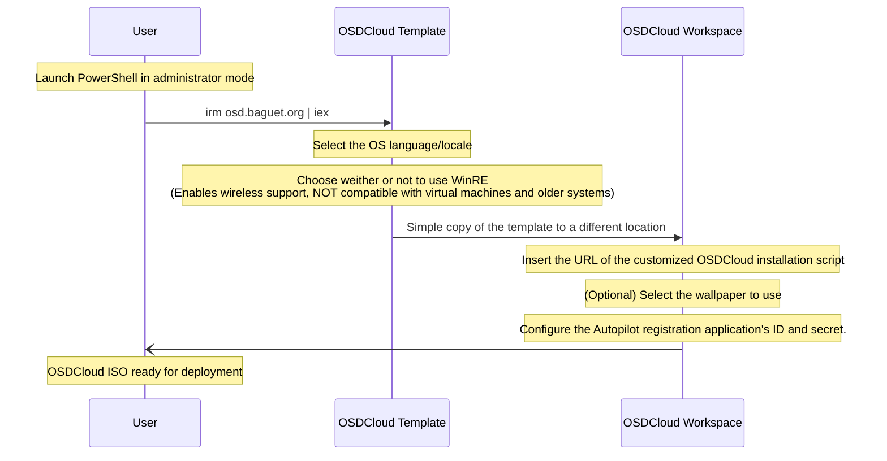

# Yggdrasil - TUI wrapper for OSDCloud

**Yggdrasil serves as a TUI wrapper for OSDCloud.**

**It also provides an opinionated startup script for WinPE.** 

> The opinionated part resides in the fact that it is designed for Autopilot registration of devices.
> 
> It also requires a Microsoft application (Application ID, Application secret) to add the device hash to Microsoft Autopilot.

## Pre-requisites

Following [OSDCloud's documentation](https://www.osdcloud.com/osdcloud/setup) :
1. [OSDCloud Powershell Module](https://www.osdcloud.com/osdcloud/setup#osd-powershell-module)
2. [ADK for Windows](https://learn.microsoft.com/en-us/windows-hardware/get-started/adk-install)
3. [Windows PE add-on for the ADK](https://learn.microsoft.com/en-us/windows-hardware/get-started/adk-install)

## Usage

### Quick Install (Recommended)

```powershell
irm osd.baguet.org | iex
```

### Manual Install (For personalization)

- Clone/Fork the repository.
- Edit `$OSDCloudParameters` from `Install-Windows.ps1` to match your environment.
- Commit and push the changes to your own repository (must be publicly accessible from your environment).
- Copy the URL of the `Install-Windows.ps1` *raw file* from your repository.
- Run `.\Prepare-OSDCloudEnv.ps1` in PowerShell.

## How OSDCloud works inside of Yggdrasil



## Troubleshooting & Tips

### Hyper-V Manager

Access the serial numbers of all virtual machines from the host using :
```powershell
Get-WmiObject -ComputerName <HOSTNAME> -Namespace root\virtualization\v2 -class Msvm_VirtualSystemSettingData | Where-Object { $_.BIOSSerialNumber -ne $null } | select elementname, BIOSSerialNumber
```

Pre-provisioning is not possible using Hyper-V because of a TPM attestation issue. See [this](https://call4cloud.nl/2022/08/ready-for-attestation-a-true-underdog-story).
